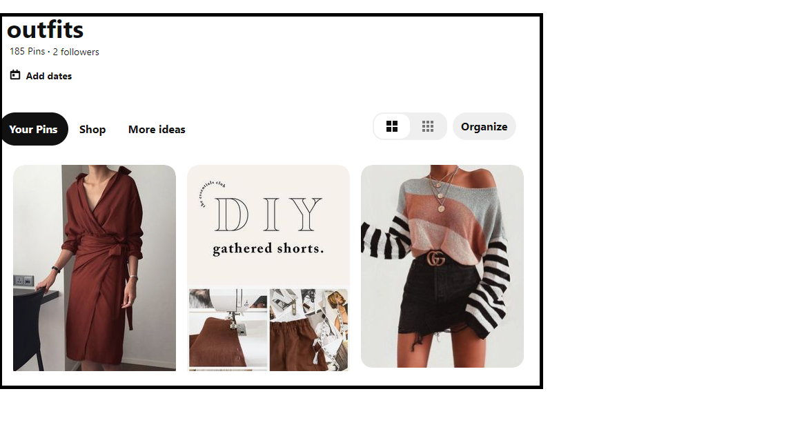

# Pinterst-style-recommender
Using Pinterest boards as input for a neural network model using Keras, new pins are analyzed and recommended for me.

Steps to create this project:
1. Set up two Pinterst boards, one with styles you like and the other with styles you don't.
2. Read in the pins from both boards and add labels such as 0 for those you like and 1 for those you don't.
3. Train a neural net using Keras to distinguish between clothing styles to recommend.
4. Get new recommendations from Pinterst using py3-pinterest library. 
5. From the new pins have the model predict which pins you will like.
6. Add those recommended pins to a new board.
7. Enjoy styles on Pinterest without having to constantly pin new styles!

